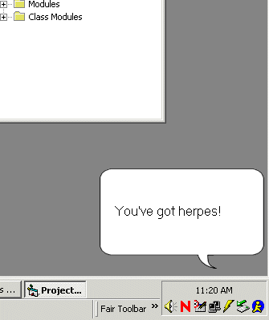



## Cool ToolTip Notify for System Tray

### Description

This code will popup a little notify window in near the system tray! It uses a transparent form and is movable by the user.

Take it easy on this newbie ;0) This is my first code submission.
 
### More Info
 
This is not complete code, pretty close to it i suppose but your gonna have to of course customize it to work with your application.

             |
---                |---
**Submitted On**   |2002-04-25 11:16:50
**By**             |[Nate Plumm](https://github.com/Planet-Source-Code/PSCIndex/blob/master/ByAuthor/nate-plumm.md)
**Level**          |Intermediate
**User Rating**    |5.0 (30 globes from 6 users)
**Compatibility**  |VB 6\.0
**Category**       |[Custom Controls/ Forms/  Menus](https://github.com/Planet-Source-Code/PSCIndex/blob/master/ByCategory/custom-controls-forms-menus__1-4.md)
**World**          |[Visual Basic](https://github.com/Planet-Source-Code/PSCIndex/blob/master/ByWorld/visual-basic.md)
**Archive File**   |[Cool\_ToolT757454252002\.zip](https://github.com/Planet-Source-Code/nate-plumm-cool-tooltip-notify-for-system-tray__1-34108/archive/master.zip)

